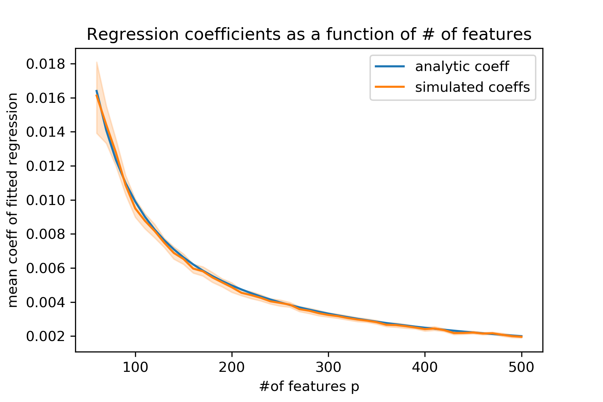
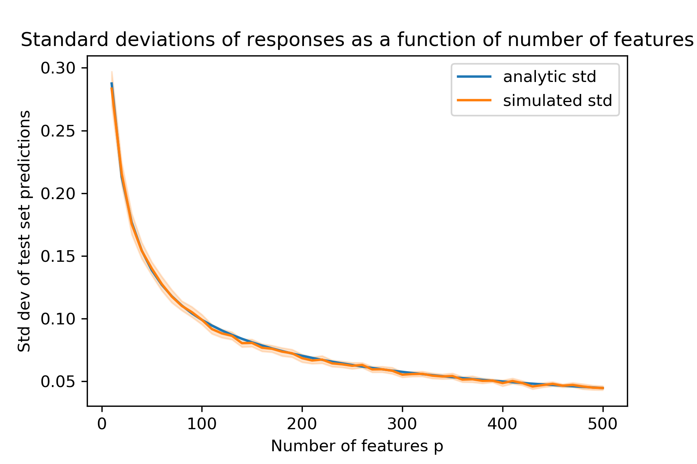

# Overfitting regression when the features are noise

We'd like to show that as the number of superfluous features in a regression increases, the variance in the predicted values actually _decreases_.

## Setup

Let the labels $y$ be drawn from a normal distribution with mean 1, variance 1: $y \sim N(1,1)$. Similarly let the $p$-dimensional features $x$ be drawn from a multivariate normal distribution with mean 1 and unit variance: $\mathbf{x} \sim N(\vec{\mathbf{1}}_{1 \times p}, I_{p \times p})$. Note that the true model is $h^*(\mathbf{x}) = 1 + \epsilon$, $\epsilon \sim N(0,1)$. 

Here we will keep the number of training samples $n$ fixed and vary the number of features. Let $Y$ be the $n \times 1$ response vector and $X$ be the $n \times p$ feature matrix.

## Variance of the fitted model
**Note 2019-06-11:** this derivation isn't what we want, as it is the variance of the test set predictions made by a ridge regression fitted on $X = \mathbf{1}_{n \times p}$

Let $h_{D_n}(\mathbf{x})= w_1x_1 + w_2x_2 + ... + w_px_p$ be the fitted regression model of a given training set $D_n$ with $n$ examples.

The variance of the predictions over a test set is:

$$
\text{Var}[h_{D_n}(\mathbf{x})] = \text{Var}[w_1x_1 + w_2x_2 + ... + w_px_p] \\
$$

Each $x_i$ follows $x_i \sim N(1,1)$, while for a single fitted model the learned $w_i$'s are constant, yielding:

\begin{align*}
\text{Var}[h_{D_n}(\mathbf{x})] &= w_1^2\text{Var}[x_1] + w_2^2\text{Var}[x_2] + ... + w_p^2\text{Var}[x_p] \\
\text{Var}[h_{D_n}(\mathbf{x})] &= \sum^p_i w_i^2
\end{align*}

What we care about however, is the prediction variance of the "average" fitted model $\overline{h}(x)$ on a training set of size $n$. Following the same algebra as above:

$$
\text{Var}[\overline{h}(\mathbf{x})] = \sum^p_i \mathbb{E}[w_i]^2
$$

Next, we'll find $\mathbb{E}[w_i]$.

## Expected value of the regression coefficients

Our features are Gaussian noise drawn from $N(1,1)$. By "multiplying by one," our feature matrix looks like a $\mathbf{1}_{n \times p}$ matrix with $N(1,1)$ Gaussian noise applied to it: $X = X * \mathbf{1}$. Applying Gaussian noise elementwise to an input matrix is equivalent to applying L2 regularization with regularization parameter $\lambda = n\sigma^2 = n$ [Refs [1](https://www.microsoft.com/en-us/research/wp-content/uploads/2016/02/bishop-tikhonov-nc-95.pdf), [2](http://madrury.github.io/jekyll/update/statistics/2017/08/12/noisy-regression.html)].

So, we have a closed form solution for the expected value of the regression coefficients $\mathbf{w}$, where $\mathbf{1}$ is $n \times p$ and $I$ is $p \times p$:

$$
\mathbf{w} = (\mathbf{1}^T\mathbf{1} + nI)^{-1} \mathbf{1}^T y
$$

The matrix $\mathbf{1}^T\mathbf{1} + nI$ that is being inverted is a $p \times p$ matrix with $2n$ on the main diagonal and $n$ in the off diagonal entries. The inverse of this matrix has $\frac{p}{n(p+1)}$ on the main diagonal and $-\frac{1}{n(p+1)}$ in the off diagonal entries (TODO write up proof). 

The expected value of each $w_i$ is then given by:

\begin{align*}
\mathbb{E}[w_i] &= \mathbb{E}[\frac{p}{n(p+1)} - (p-1)\frac{1}{n(p+1)}\big(\sum^p_i y_i \big)] \\
\mathbb{E}[w_i] &= \frac{1}{n(p+1)}\mathbb{E}[\sum^p_i y_i] \\
\mathbb{E}[w_i] &= \frac{1}{n(p+1)}\sum^p_i \mathbb{E}[y_i] \\
\mathbb{E}[w_i] &= \frac{1}{(p+1)}
\end{align*}

We verify this via simulation:

## Variance of the fitted model, for fixed constant training data

Using $\text{Var}[\overline{h}(x)] = \sum^p_i \mathbb{E}[w_i^2]$ and $\mathbb{E}[w_i] = \frac{1}{p+1}$, we have that:

$$
\text{Var}[\overline{h}(x)] = \frac{p}{(p+1)^2}
$$

We see that as the number of uninformative features increases, the variance of the responses of our fitted regression decreases. We verify via simulation:

## Contextual note

This is an analogy to overfitting in the general case when adding superfluous features $p$ only contribute noise.

